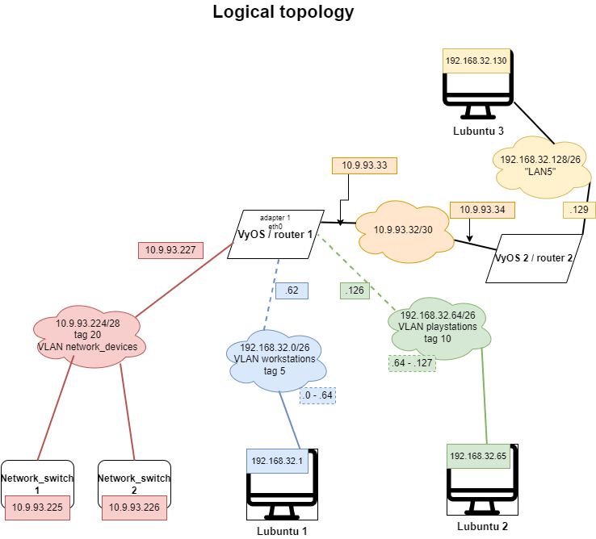
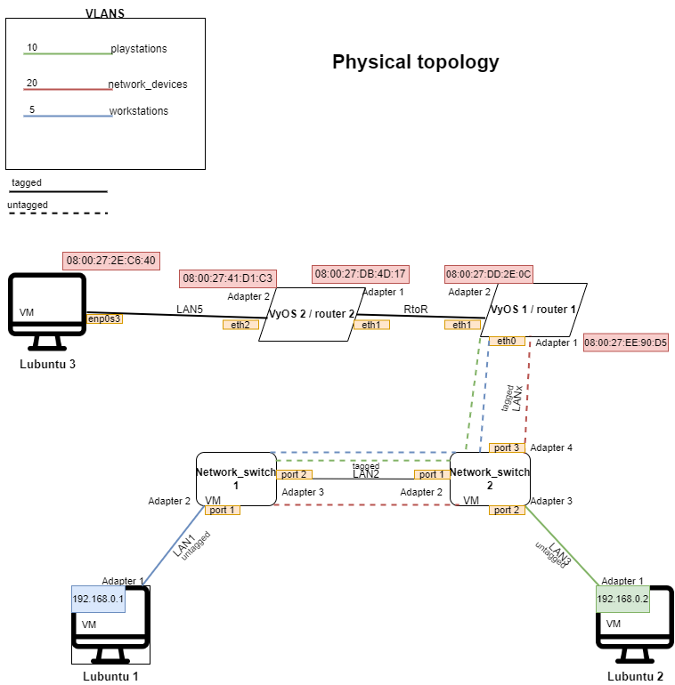
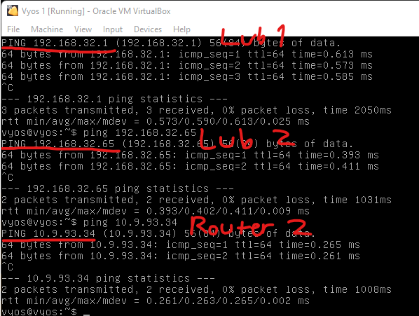
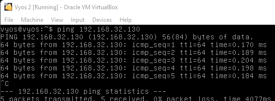
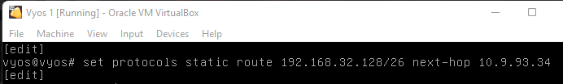
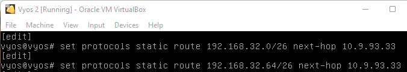
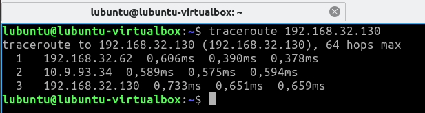
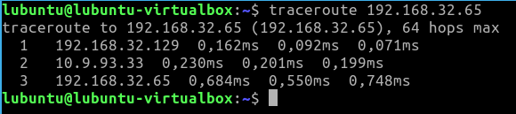

# Documentation for E05

## Topology maps
 

 

## Getting started

I cloned VyOS 1 to get the second one and used Lubuntu wireshark VM as Lubuntu 3.

I changed Lubuntu adapter settings from **LAN 3** to **LAN 5**

 

VyOS 1 and 2 use untagged IPs. These are their configs:

 


### DHCP configuration:

**VyOs 1** Configurations for VLAN workstations:
```
VLAN workstations: 192.168.32.0/26
set service dhcp-server shared-network-name VLAN5 subnet 192.168.32.0/26 default-router 192.168.32.62
set service dhcp-server shared-network-name VLAN5 subnet 192.168.32.0/26 range PCs start 192.168.32.1
set service dhcp-server shared-network-name VLAN5 subnet 192.168.32.0/26 range PCs stop 192.168.32.50
```

**VyOs 1** Configurations for VLAN playstations:
```
VLAN playstations: 192.168.32.64/26
set service dhcp-server shared-network-name VLAN10 subnet 192.168.32.64/26 default-router 192.168.32.126
set service dhcp-server shared-network-name VLAN10 subnet 192.168.32.64/26 range PCs start 192.168.32.65
set service dhcp-server shared-network-name VLAN10 subnet 192.168.32.64/26 range PCs stop 192.168.32.105
```

**VyOs 2** Configurations for LAN 5:
```
LAN5: 192.168.32.128/26
set service dhcp-server shared-network-name LAN5 subnet 192.168.32.128/26 default-router 192.168.32.129
set service dhcp-server shared-network-name LAN5 subnet 192.168.32.128/26 range PCs start 192.168.32.130
set service dhcp-server shared-network-name LAN5 subnet 192.168.32.128/26 range PCs stop 192.168.32.180
```

**show dhcp server leases** -command:


I then pinged **Lubuntu 1-2** and **router 2** from **router 1**:



Pinged **Lubuntu 3** from **router 2**:




I then created static routes for both routers:




¨
### Traceroutes

**Lubuntu 1** traceroute to **Lubuntu 3**:



**Lubuntu 3** traceroute to **Lubuntu 2**:



## Configs

**Router 1**
```
interfaces {
    ethernet eth0 {
        duplex auto
        hw-id 08:00:27:ee:90:d5
        smp-affinity auto
        speed auto
        vif 5 {
            address 192.168.32.62/26
            description Workstations
        }
        vif 10 {
            address 192.168.32.126/26
            description Playstations
        }
        vif 20 {
            address 10.9.93.227/28
            description network_devices
        }
    }
    ethernet eth1 {
        address 10.9.93.33/30
        description RtoR
        duplex auto
        hw-id 08:00:27:dd:2e:0c
        smp-affinity auto
        speed auto
    }
    loopback lo {
    }
}
protocols {
    static {
        route 192.168.32.128/26 {
            next-hop 10.9.93.34 {
            }
        }
    }
}
service {
    dhcp-server {
        shared-network-name VLAN5 {
            subnet 192.168.32.0/26 {
                default-router 192.168.32.62
                range PCs {
                    start 192.168.32.1
                    stop 192.168.32.50
                }
            }
        }
        shared-network-name VLAN10 {
            subnet 192.168.32.64/26 {
                default-router 192.168.32.126
                range PCs {
                    start 192.168.32.65
                    stop 192.168.32.105
                }
            }
        }
    }
    ssh {
        port 22
    }
}
system {
    config-management {
        commit-revisions 100
    }
    console {
        device ttyS0 {
            speed 9600
        }
    }
    host-name vyos
    login {
        user vyos {
            authentication {
                encrypted-password ****************
                plaintext-password ****************
            }
            level admin
        }
    }
    syslog {
        global {
            facility all {
                level info
            }
            facility protocols {
                level debug
            }
        }
    }
    time-zone UTC
}
```

**Router 2**
```
interfaces {
    ethernet eth1 {
        address 10.9.93.34/30
        description RtoR
        duplex auto
        hw-id 08:00:27:db:4d:17
        smp-affinity auto
        speed auto
    }
    ethernet eth2 {
        address 192.168.32.129/26
        description LAN5
        duplex auto
        hw-id 08:00:27:41:d1:c3
        smp-affinity auto
        speed auto
    }
    loopback lo {
    }
}
protocols {
    static {
        route 192.168.32.0/26 {
            next-hop 10.9.93.33 {
            }
        }
        route 192.168.32.64/26 {
            next-hop 10.9.93.33 {
            }
        }
    }
}
service {
    dhcp-server {
        shared-network-name LAN5 {
            subnet 192.168.32.128/26 {
                default-router 192.168.32.129
                range PCs {
                    start 192.168.32.130
                    stop 192.168.32.180
                }
            }
        }
    }
    ssh {
        port 22
    }
}
system {
    config-management {
        commit-revisions 100
    }
    console {
        device ttyS0 {
            speed 9600
        }
    }
    host-name vyos
    login {
        user vyos {
            authentication {
                encrypted-password ****************
                plaintext-password ****************
            }
            level admin
        }
    }
    syslog {
        global {
            facility all {
                level info
            }
            facility protocols {
                level debug
            }
        }
    }
    time-zone UTC
}
```
