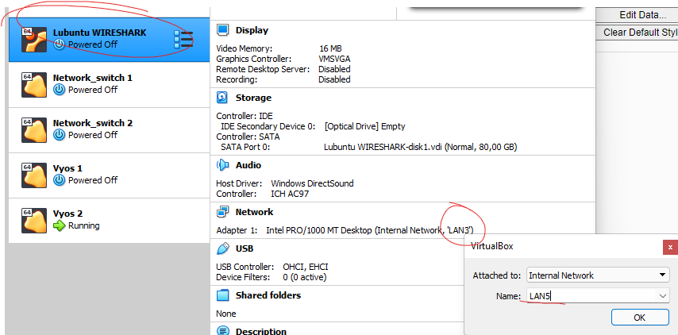
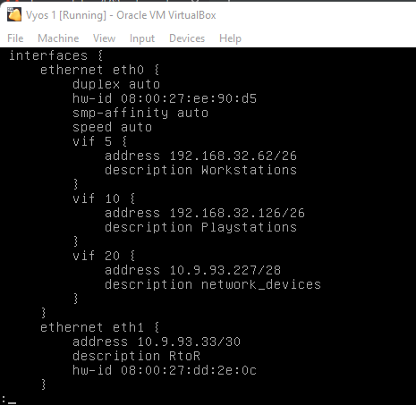
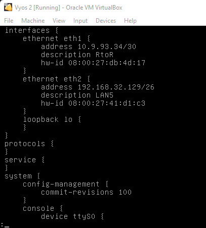
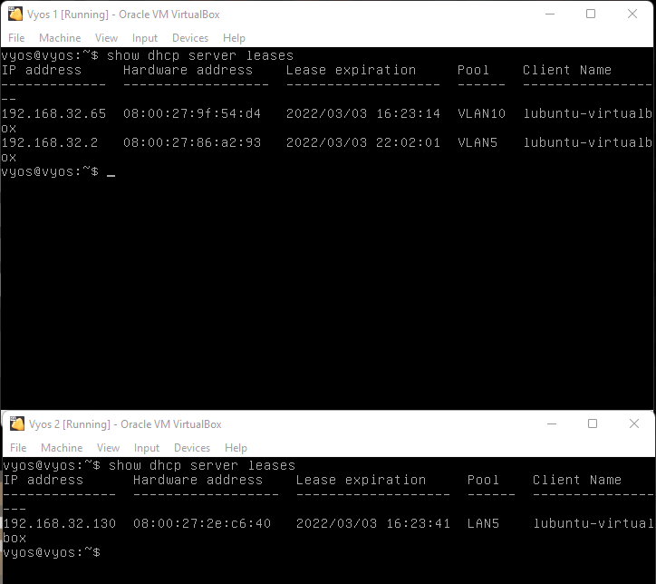

# Documentation for E05

I cloned VyOS 1 to get the second one and used Lubuntu wireshark VM as Lubuntu 3.

I changed Lubuntu adapter settings from **LAN 3** to **LAN 5**

 

VyOS 1 and 2 use untagged IPs. These are their configs:

 


DHCP configuration:

**VyOs 1** Configurations for VLAN workstations:
```
VLAN workstations: 192.168.32.0/26
set service dhcp-server shared-network-name VLAN5 subnet 192.168.32.0/26 default-router 192.168.32.62
set service dhcp-server shared-network-name VLAN5 subnet 192.168.32.0/26 range PCs start 192.168.32.1
set service dhcp-server shared-network-name VLAN5 subnet 192.168.32.0/26 range PCs stop 192.168.32.50
```

**VyOs 1** Configurations for VLAN playstations:
```
VLAN playstations: 192.168.32.64/26
set service dhcp-server shared-network-name VLAN10 subnet 192.168.32.64/26 default-router 192.168.32.126
set service dhcp-server shared-network-name VLAN10 subnet 192.168.32.64/26 range PCs start 192.168.32.65
set service dhcp-server shared-network-name VLAN10 subnet 192.168.32.64/26 range PCs stop 192.168.32.105
```

**VyOs 2** Configurations for LAN 5:
```
LAN5: 192.168.32.128/26
set service dhcp-server shared-network-name LAN5 subnet 192.168.32.128/26 default-router 192.168.32.129
set service dhcp-server shared-network-name LAN5 subnet 192.168.32.128/26 range PCs start 192.168.32.130
set service dhcp-server shared-network-name LAN5 subnet 192.168.32.128/26 range PCs stop 192.168.32.180
```

**show dhcp server leases** -command:


